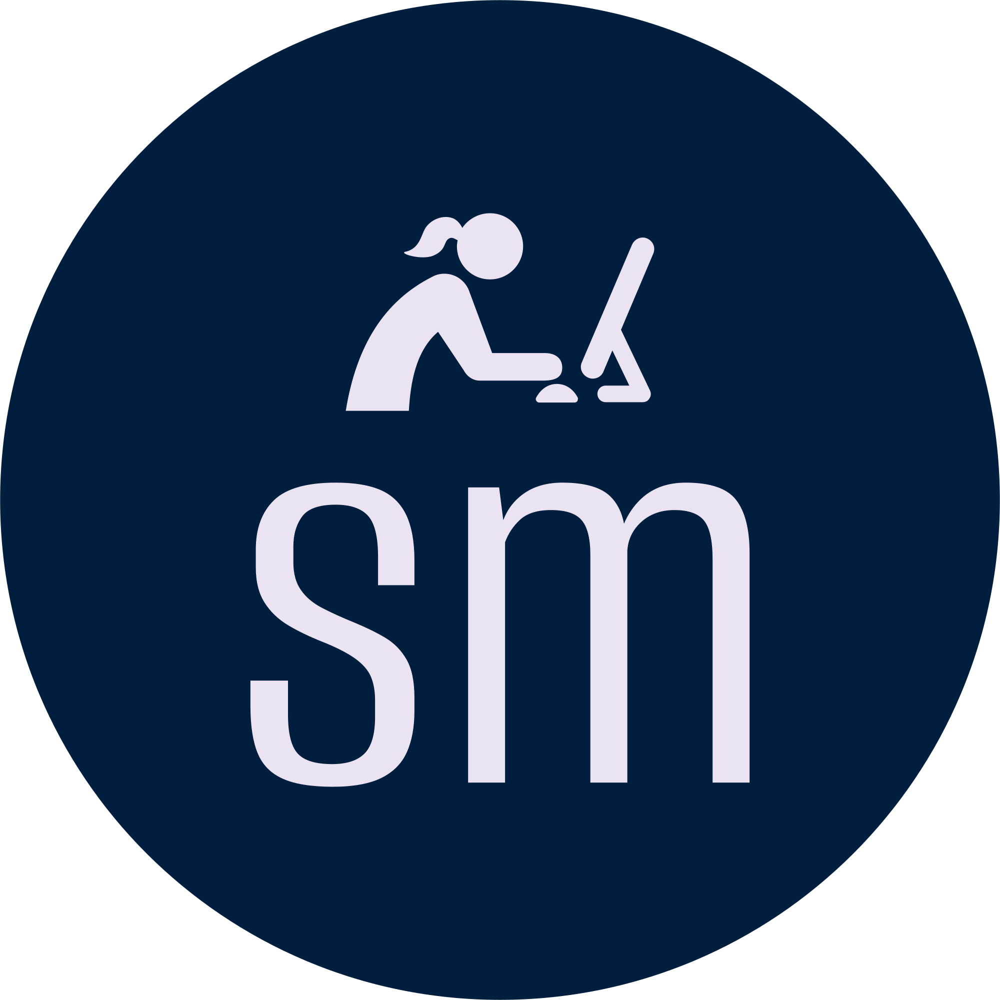

# Portfolio Website for Sarah Meyers

This is a [T3 Stack](https://create.t3.gg/) project bootstrapped with `create-t3-app` used to demonstrate coding ability and design by Sarah Meyers.

## Getting Started

Developed using the Visual Studio Code editor on a Macbook Pro. Node Package Manager is used to deploy locally, test and format with the following (defined in `package.json`):

`npm run`
* `build`
* `dev`
* `lint`
* `format`
* `format:fix`

## Dependencies

- [Next.js](https://nextjs.org)
- [Tailwind CSS](https://tailwindcss.com)
- [tRPC](https://trpc.io)

## Contributing

Commiting changes to a new branch following the naming format `feat/[feature name]` or `fix/[bug name]`.
Opening a pull request will automatically deploy a preview with Netlify.

## Deployment

Using Netlify to deploy the project from Github to the domain [sarahmeyers.dev](https://www.sarahmeyers.dev).
Commits and merges into the main branch will automatically be deployed.
